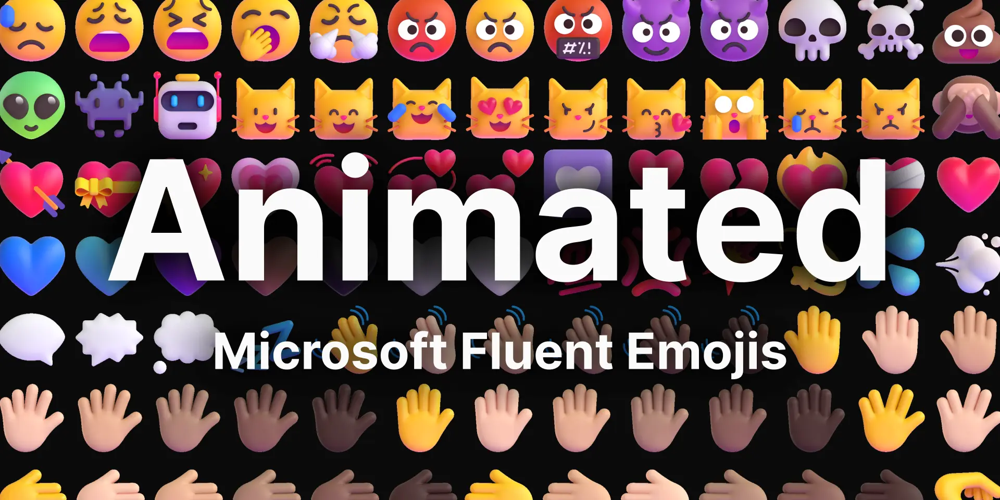

<p align="center">
  
</p>

# Animated Fluent Emojis

**Animated Fluent Emojis** is a React component library that brings Microsoft's Fluent emojis to life in your web applications. This library offers an easy way to integrate expressive and engaging animated emojis, enhancing user experience and visual appeal in your React projects.

<p align="center">
  
  
  
</p>

> 🎉 **Exclusive Feature:** Until now, these Animated Fluent Emojis were only available within Microsoft Teams. This library makes them accessible for use in any web application for the first time, bringing a unique and lively emoji experience to your projects!

<details>
<summary>Table of Contents</summary>

- [Features](#features-)
- [Tech Stack](#tech-stack-)
- [Installation](#installation-)
- [Usage](#usage-)
- [Props](#props)
- [Examples](#examples)
- [Emoji Categories](#emoji-categories-)
- [Contributing](#contributing)
- [Support the Project](#support-the-project)
- [License](#license-)
- [Acknowledgements](#acknowledgements)

</details>

## Features 🌟

- 🚀 **Easy Integration**: Simple React component for quick implementation in your projects.
- 🎨 **Customizable**: Adjust size, animation behavior, and more to fit your design needs.
- 🔄 **Flexible Animation**: Support for autoplay and hover-triggered animations.
- 🌈 **Wide Variety**: Access to a diverse set of emojis from Microsoft's Fluent Emoji collection.
- 📦 **Lightweight**: Optimized for performance to keep your applications fast and responsive.
- 🌐 **TypeScript Support**: Full TypeScript support for improved development experience.

## Tech Stack 🧰

- [![React][React]][React-url]
- [![TypeScript][TypeScript]][TypeScript-url]
- [![Vite][Vite]][Vite-url]

## Installation 🔧

To install Animated Fluent Emojis in your project, run one of the following commands:

```sh
npm install animated-fluent-emojis
# or
pnpm add animated-fluent-emojis
```

## Usage 📚

1. Import the Emoji component in your React file:

   ```jsx
   import { Emoji } from 'animated-fluent-emojis';
   ```

2. Use the component in your JSX:

   ```jsx
   <Emoji id="smiling-face" />
   ```

3. Customize the emoji with props:
   ```jsx
   <Emoji id="party-popper" size={64} playOnHover animationIterations={3} />
   ```

## Props

| Prop                | Type                 | Default | Description                                          |
| ------------------- | -------------------- | ------- | ---------------------------------------------------- |
| id                  | string               | -       | The unique identifier of the emoji                   |
| size                | number               | 100     | The size of the emoji in pixels                      |
| playOnHover         | boolean              | false   | Whether to play the animation on hover               |
| animationIterations | number or 'infinite' | 2       | The number of times to play the animation on load    |
| autoPlay            | boolean              | true    | Whether to automatically play the animation on mount |

## Examples

### Basic Usage

```jsx
import React from 'react';
import { Emoji } from 'animated-fluent-emojis';

function App() {
	return (
		<div>
			<h1>Hello, Animated Emojis!</h1>
			<Emoji id="1f4af_hundredpointssymbol" />
			<Emoji id="1f92f_explodinghead" size={64} playOnHover />
			<Emoji id="launch" animationIterations={3} />
		</div>
	);
}

export default App;
```

## Emoji Categories 📋

For a complete list of available emojis and their corresponding IDs, Unicode representations, descriptions, and keywords, please refer to our [Emoji List](./docs/EMOJI_LIST.md). The emojis are organized into the following categories:

- [Activities](./docs/EMOJI_LIST_Activities.md)
- [Animals](./docs/EMOJI_LIST_Animals.md)
- [Food](./docs/EMOJI_LIST_Food.md)
- [Hand Gestures](./docs/EMOJI_LIST_Hand_gestures.md)
- [Objects](./docs/EMOJI_LIST_Objects.md)
- [People](./docs/EMOJI_LIST_People.md)
- [Smileys](./docs/EMOJI_LIST_Smilies.md)
- [Symbols](./docs/EMOJI_LIST_Symbols.md)
- [Travel and Places](./docs/EMOJI_LIST_Travel_and_places.md)

## Contributing

We welcome contributions to Animated Fluent Emojis! If you have suggestions for improvements or encounter any issues, please feel free to open an issue or submit a pull request.

Contribution guidelines are currently being developed. In the meantime, please feel free to open issues or submit pull requests following common open-source practices.

## Support the Project

If you find Animated Fluent Emojis useful, please consider supporting the project:

- [![GitHub Stars][GitHub Stars]][GitHub-url]
- [![GitHub Follow][GitHub Follow]][GitHub-follow-url]
- [![X Follow][X-follow]][X-url]
- [![Ko-fi][Ko-fi]][Ko-fi-url]

Your support helps maintain and improve Animated Fluent Emojis!

## License 📄

Animated Fluent Emojis is totally free for commercial and personal use, this software is licensed under the [ISC License](LICENSE).

## Acknowledgements

- Microsoft for their [Fluent Emoji][Microsoft Fluent Emojis] set
- [Tarikul Islam Anik][Tarikul Islam Anik Profile] for the [Animated Fluent Emojis][Tarikul Islam Anik Repo] project, which served as inspiration for this library

[React]: https://img.shields.io/badge/React-61DAFB.svg?style=for-the-badge&logo=React&logoColor=black
[React-url]: https://react.dev/
[TypeScript]: https://img.shields.io/badge/TypeScript-3178C6.svg?style=for-the-badge&logo=TypeScript&logoColor=white
[TypeScript-url]: https://www.typescriptlang.org/
[Vite]: https://img.shields.io/badge/Vite-646CFF.svg?style=for-the-badge&logo=Vite&logoColor=white
[Vite-url]: https://vitejs.dev/
[GitHub Stars]: https://img.shields.io/github/stars/andryore/animated-fluent-emojis?style=for-the-badge&logo=github&logoColor=white&labelColor=24292e
[GitHub-url]: https://github.com/andryore/animated-fluent-emojis
[X-follow]: https://img.shields.io/badge/X-000000.svg?style=for-the-badge&logo=X&logoColor=white
[X-url]: https://twitter.com/andryore
[GitHub Follow]: https://img.shields.io/github/followers/andryore?style=for-the-badge&logo=github&logoColor=white&labelColor=24292e
[GitHub-follow-url]: https://github.com/andryore
[Ko-fi]: https://img.shields.io/badge/Kofi-FF5E5B.svg?style=for-the-badge&logo=Ko-fi&logoColor=white
[Ko-fi-url]: https://ko-fi.com/andryore
[Microsoft Fluent Emojis]: https://github.com/microsoft/fluentui-emoji
[Tarikul Islam Anik Profile]: https://github.com/Tarikul-Islam-Anik
[Tarikul Islam Anik Repo]: https://github.com/Tarikul-Islam-Anik/Animated-Fluent-Emojis
