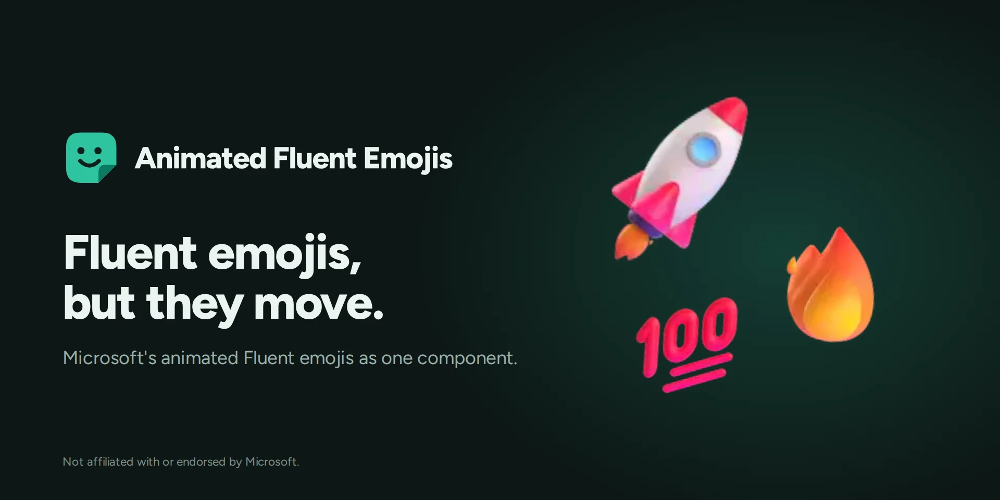

<p align="center">
  <picture>
    <source media="(prefers-color-scheme: dark)" srcset="./docs/assets/Cover.webp">
    <source media="(prefers-color-scheme: light)" srcset="./docs/assets/Cover-light.webp">
    
  </picture>
</p>

# Animated Fluent Emojis

<p align="center">
  <a href="https://github.com/AndryOre/animated-fluent-emojis/actions/workflows/ci.yml"></a>
  <a href="https://www.npmjs.com/package/animated-fluent-emojis"></a>
  <a href="LICENSE"></a>
  <a href="https://scorecard.dev/viewer/?uri=github.com/AndryOre/animated-fluent-emojis"></a>
  <a href="https://www.npmjs.com/package/animated-fluent-emojis"></a>
  <a href="https://bundlephobia.com/package/animated-fluent-emojis"></a>
  <a href="https://www.npmjs.com/package/animated-fluent-emojis"></a>
</p>

**Fluent emojis, but they move.**

Drop Microsoft's animated Fluent emojis into a React, Vue, Svelte or Astro app,
or any page through a web component: one import, one tag. They play on load or
on hover, rest on a still frame when someone asks for less motion, and hold
their space in the layout while they load.

```jsx
<Emoji id="1f44b_wavinghand" />
```

The artwork belongs to Microsoft. The code is MIT. This project is not
affiliated with or endorsed by Microsoft. See
[Assets and licensing](#assets-and-licensing).

<details>
<summary>Table of Contents</summary>

- [Features](#features)
- [Installation](#installation)
- [Works with](#works-with)
- [Usage](#usage)
- [Props](#props)
- [Documentation](#documentation)
- [Migrating from 0.4](#migrating-from-04)
- [Emoji Categories](#emoji-categories)
- [Contributing](#contributing)
- [Support the Project](#support-the-project)
- [License](#license)
- [Assets and licensing](#assets-and-licensing)
- [Acknowledgements](#acknowledgements)

</details>

## Features

- **One component.** `<Emoji id="…" />`, with `size`, `skinTone` and more.
- **Plays when you want.** On load, on hover or focus, or driven by `playing`.
- **Rests when asked.** Under reduced motion it stays on its poster frame.
- **Holds its space.** A placeholder of the final size keeps the layout steady.
- **Sharp on HD screens.** HD sprite sheets are served at 2x.
- **Accessible.** `alt` defaults to the description; failures show a glyph.
- **Typed.** TypeScript types, with autocomplete for emoji ids.

## Installation

Install the package. It is ESM-only. Every framework peer is optional, so you
only install the one you use (`react` and `react-dom` 18 or 19, `vue`, `svelte`,
`astro`, `solid-js` or `preact`):

```sh
bun add animated-fluent-emojis
```

## Works with

One package, one import path per framework. Each row links to its install and
usage steps.

| Framework    | Import                                      | Guide                                      |
| ------------ | ------------------------------------------- | ------------------------------------------ |
| React        | `animated-fluent-emojis/react`              | [Usage](docs/usage.md#react)               |
| Vue          | `animated-fluent-emojis/vue`                | [Usage](docs/usage.md#vue)                 |
| Svelte       | `animated-fluent-emojis/svelte`             | [Usage](docs/usage.md#svelte)              |
| Astro        | `animated-fluent-emojis/astro`              | [Usage](docs/usage.md#astro)               |
| Plain HTML   | `animated-fluent-emojis/element`            | [Usage](docs/usage.md#plain-html)          |
| Angular      | `animated-fluent-emojis/element`            | [How-to](docs/how-to/use-with-angular.md)  |
| Solid        | `animated-fluent-emojis/element`            | [How-to](docs/how-to/use-with-solid.md)    |
| Preact       | `animated-fluent-emojis/element`            | [How-to](docs/how-to/use-with-preact.md)   |
| No framework | `createEmoji` from `animated-fluent-emojis` | [Usage](docs/usage.md#without-a-framework) |

Lit, Alpine and htmx use `<fluent-emoji>` too.

## Usage

Import the component and the stylesheet once, for example in your app entry. The
stylesheet carries the animation keyframes; without it emojis render as static
sprite sheets.

```jsx
import { Emoji } from 'animated-fluent-emojis/react'

import 'animated-fluent-emojis/style.css'

;<Emoji id="1f44b_wavinghand" size={64} playOnHover skinTone="medium" />
```

The manifest is fetched on first render, never at import; see the
[usage guide](docs/usage.md#fallback) for loading and failure behaviour.

### Next.js and server components

The bundle starts with `"use client";`, so a server component can import
`Emoji`. Import the stylesheet once, in the root layout. It renders a
placeholder on the server and the emoji after hydration. Call `configureEmojis`
and `preloadEmojis` from a client module, not a Server Component.

## Props

These are the React props; the other adapters take the same set in their own
spelling, see the [usage guide](docs/usage.md#frameworks).

| Prop                | Type                 | Default     | Description                                     |
| ------------------- | -------------------- | ----------- | ----------------------------------------------- |
| id                  | `EmojiId` or string  | -           | The emoji to render; known ids autocomplete     |
| size                | number or string     | 100         | Pixels, or any CSS length such as `2rem`        |
| playOnHover         | boolean              | false       | Play on hover and on keyboard focus             |
| animationIterations | number or 'infinite' | 2           | How many times to play on load                  |
| autoPlay            | boolean              | true        | Play on mount                                   |
| playing             | boolean              | -           | Controls playback: `true` plays, `false` pauses |
| onPlaybackEnd       | function             | -           | Called when a finite run ends                   |
| skinTone            | SkinTone             | 'default'   | Skin tone for emojis that have variants         |
| alt                 | string               | description | Accessible text; `""` marks it decorative       |
| fallback            | ReactNode            | glyph       | Rendered when the image or manifest fails       |

`className`, `style`, `ref`, `onLoad`, `onError` and any other `<span>`
attribute are also accepted. Every prop, with edge cases, is in the
[usage guide](docs/usage.md#props).

## Documentation

| Doc                                        | Covers                                        |
| ------------------------------------------ | --------------------------------------------- |
| [Usage guide](docs/usage.md)               | Frameworks, props, playback, fallback, lookup |
| [How-to guides](docs/how-to/README.md)     | Angular, Solid, Preact, Next.js and more      |
| [Docs index](docs/README.md)               | Every document in this repository             |
| [Troubleshooting](docs/troubleshooting.md) | Fixes for common problems, by symptom         |
| [Security design](docs/security.md)        | Threat model and assurance case               |
| [Changelog](CHANGELOG.md)                  | Release notes                                 |
| [Roadmap](ROADMAP.md)                      | Project direction                             |
| [Governance](GOVERNANCE.md)                | Decisions and project continuity              |
| [Contributing](CONTRIBUTING.md)            | Setup, conventions and merging                |
| [Code of Conduct](CODE_OF_CONDUCT.md)      | Community standards                           |

## Migrating from 0.4

- The glyph fallback is the new default: a failed sprite sheet shows the emoji's
  native character. Pass `fallback={null}` to restore the 0.4 behaviour.
- `Emoji` now forwards `ref` and any `<span>` attribute to its root span, and
  merges `className` and `style`.
- A failed manifest load is retried on the next mount, `preloadEmojis` call or
  `online` event, and `onError` now reports it.
- Autoplay waits for the image, the viewport and a visible tab; see
  [Playback](docs/usage.md#playback).
- The runtime reads the versioned asset layout (`/v1/`) with a compact manifest.
  If you mirror the asset site, publish that layout with the 0.5 pipeline; see
  the [changelog](CHANGELOG.md),
  [ADR 0010](docs/adr/0010-versioned-asset-layout-and-live-seeding.md) and
  [ADR 0011](docs/adr/0011-compact-slim-manifest-and-hd-frame-cap.md).
- An unknown `id` now renders `fallback` (nothing by default) and never calls
  `onError`.
- Emojis with more than 81 frames lost their HD sheet. `size` also accepts a CSS
  length string.

Terms such as fallback glyph and asset layout version are defined in
[`CONTEXT.md`](CONTEXT.md).

## Emoji Categories

Every emoji, with its id, Unicode, description and keywords, is in the
[Emoji List](./docs/EMOJI_LIST.md), split by category:
[Activities](./docs/EMOJI_LIST_Activities.md),
[Animals](./docs/EMOJI_LIST_Animals.md), [Food](./docs/EMOJI_LIST_Food.md),
[Hand Gestures](./docs/EMOJI_LIST_Hand_gestures.md),
[Objects](./docs/EMOJI_LIST_Objects.md), [People](./docs/EMOJI_LIST_People.md),
[Smileys](./docs/EMOJI_LIST_Smilies.md), [Symbols](./docs/EMOJI_LIST_Symbols.md)
and [Travel and Places](./docs/EMOJI_LIST_Travel_and_places.md).

## Contributing

We welcome contributions to Animated Fluent Emojis! Read
[CONTRIBUTING](CONTRIBUTING.md) for setup and conventions, and the
[development guide](docs/development.md) for scripts and tooling. Everyone
taking part follows the [Code of Conduct](CODE_OF_CONDUCT.md). To report a
vulnerability, follow [SECURITY](.github/SECURITY.md).

[](https://github.com/AndryOre/animated-fluent-emojis/graphs/contributors)

## Support the Project

If you find Animated Fluent Emojis useful, please consider supporting it:

[![GitHub Stars][GitHub Stars]][GitHub-url]
[![GitHub Follow][GitHub Follow]][GitHub-follow-url]
[![X Follow][X-follow]][X-url] [![Ko-fi][Ko-fi]][Ko-fi-url]

## License

Animated Fluent Emojis is free for commercial and personal use. The software is
licensed under the [MIT](LICENSE) © Andry Orellana.

## Assets and licensing

The manifest and sprite sheets are served from the asset site on Cloudflare
Pages (`animated-fluent-emojis.pages.dev`), generated by `scripts/assets` and
refreshed automatically. Most emojis come from the animated Fluent emoji set
that Microsoft Teams publishes; the rest come from Microsoft's MIT-licensed
[fluentui-emoji-animated][Microsoft Fluent Emojis Animated] repository. The
sprites remain Microsoft's assets: this package's MIT license covers the code
only. The MIT notice for the official repository is published at
`/LICENSE-fluentui-emoji-animated.txt` on the asset site.

## Acknowledgements

- Microsoft for their [Fluent Emoji][Microsoft Fluent Emojis] set
- [Tarikul Islam Anik][Tarikul Islam Anik Profile] for the [Animated Fluent
  Emojis][Tarikul Islam Anik Repo] project, which served as inspiration for this
  library

[GitHub Stars]:
  https://img.shields.io/github/stars/andryore/animated-fluent-emojis?style=for-the-badge&logo=github&logoColor=white&labelColor=24292e
[GitHub-url]: https://github.com/andryore/animated-fluent-emojis
[X-follow]:
  https://img.shields.io/badge/X-000000.svg?style=for-the-badge&logo=X&logoColor=white
[X-url]: https://twitter.com/andryore
[GitHub Follow]:
  https://img.shields.io/github/followers/andryore?style=for-the-badge&logo=github&logoColor=white&labelColor=24292e
[GitHub-follow-url]: https://github.com/andryore
[Ko-fi]:
  https://img.shields.io/badge/Kofi-FF5E5B.svg?style=for-the-badge&logo=Ko-fi&logoColor=white
[Ko-fi-url]: https://ko-fi.com/andryore
[Microsoft Fluent Emojis]: https://github.com/microsoft/fluentui-emoji
[Microsoft Fluent Emojis Animated]:
  https://github.com/microsoft/fluentui-emoji-animated
[Tarikul Islam Anik Profile]: https://github.com/Tarikul-Islam-Anik
[Tarikul Islam Anik Repo]:
  https://github.com/Tarikul-Islam-Anik/Animated-Fluent-Emojis
